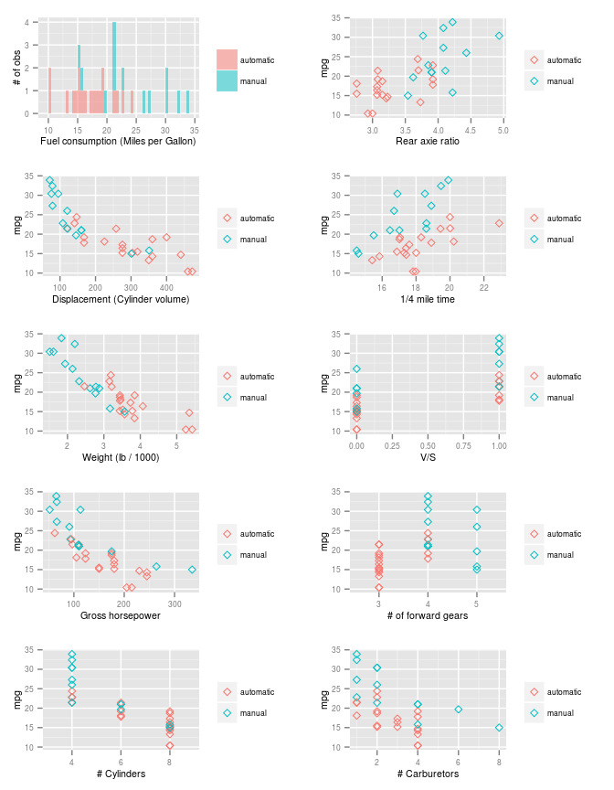
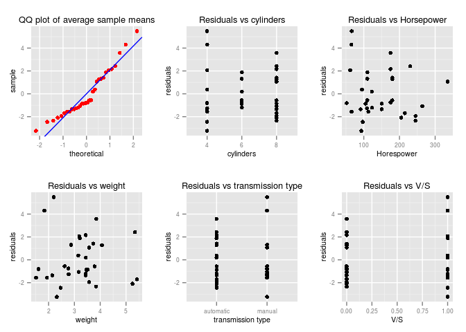

# Factors influencing fuel consumption in cars
Aurimas R.  
01/24/2015  

#Executive summary

This report investigates the relationship between manual / automatic transmission and fuel consumption. Based on `mtcars` dataset, we determine that fuel consumption is primarily influenced by car weight and number of cylinders (both factors having negative influence). It appears that transmission type does not have an impact alone once these factors are considered. However, we found a weak relationship once weight is considered. Based on our results, cars with weight below 2,666 lbs have lower fuel consumption if manual transmission is used, whereas heavier cars see an opposite effect.

#Understanding the data

The `mtcars` dataset includes 11 variables: `mpg` (fuel consumption in miles per gallon), `cyl` (number of cylinders), `disp` (displacement -  volume of an engine's cylinders), `hp` (gross horsepower), `drat` (rear axie ratio), `wt` (weight expressed as lb/1000), `qsec` (time to reach 1/4 mile), `vs` (V/S), `am` (transmission (1 = manual)), `gear` (number of forward gears) and `carb` (number or carburetors).

As the focus of this report is to understand the relationship between fuel consumption and transmission type, let's look at a few charts to understand what relationships could be prevalent (see appendix 1).


It appears that fuel consumption indeed differs depending on transmission type (manual transmissions appear to have higher mpg), yet fuel consumption also appears to be related to weight, displacement and horsepower, and this should be taken into account. 

#Investigating factors influencing mpg
## Direct relationship between fuel consumption and transmission type


Let's first see if the means of mpg are different in the subsets of data split by transmission type. We applied Welsh test for two-sample differences (see output in appendix 2). The p-value is well below 5%, thus we giving indications that the means are different. As can be seen above, automatic transmission group has lower (worse) mpg, indicating higher fuel consumption. In particular, the difference between the two groups is 7.2449393. However, this test is very simplistic. It assumes that we are missing no other important variables, which is definitely not the case. We will now investigate the impact of transmission type holding other factors constant.

##Model selection
###Determining independent variables


First, we will explore the relationship once the 3 additional variables considered above are included (horsepower, cylinder volume and weight). Formula: `mpg ~ wt + hp + disp + am`. The regression output (appendix 3) indicates that transmission type does not have a significant impact on fuel consumption once other factors are taken into account (p-value > 0.5%). In particular, only weight and horsepower appear to explain the variation in fuel consumption (both have a negative impact).


To ensure that our visual analysis did miss out anything, we also tested if other models (including more variables from the dataset) perform better. The analysis was performed by randomising the order of independent variables, adding them one-by-one, and testing if the fit improved using `anova` test (without considering interaction terms, see appendix 4 for output of analysis).  The best model obtained was as follows: `mpg ~ cyl + wt`


```
##             Estimate Std. Error t value Pr(>|t|)
## (Intercept)   33.991      1.888  18.006    0.000
## cyl6          -4.256      1.386  -3.070    0.005
## cyl8          -6.071      1.652  -3.674    0.001
## wt            -3.206      0.754  -4.252    0.000
```

The model's explanatory power (adjusted r-squared) is 82%. The model tells us that weight and increase in cylinder number both affect fuel consumption negatively. Note that the cylinder variable was converted to a factor as it only takes 3 values. The `cyl6` and `cyl8` coefficients should thus be interpreted as "change in mpg by changing cylinder number from 4 to (6 or 8), holding vehicle weight constant".

### Impact of transmission type


Let's now include transmission type into equation, also considering interaction terms: `mpg ~ cyl + wt + am + cyl:am + wt:am`. The results (presented in Appendix 5) should be interpreted as follows:

 - At 5% significance level, factors `cyl8` (8-cylinders), `wt` (weight), `ammanual` (manual transmission) and interaction `wt:ammanual` (impact of a unit change in weight and to a manual transmission type) are statistically significant to fuel consumption level.
 - Weight and inclusion of 8 cylinders have a negative impact to fuel consumption (reducing expected mileage by 2.3 miles for each 1000 lbs added and 5.2 miles if 4-cylinders are changed to 8-cylinders), holding other factors constant
 - Holding other factors constant, manual transmission improves mileage by 13.6 miles, less 5.1 miles for each 1000 lbs. In other words, the impact of manual transmission has a positive impact on fuel consumption if car weight is less than 2,666lbs (9 cars in the dataset), but negative impact otherwise (23 cars in the dataset). 
 - Note that the statistical power of the two terms terms related to transmission type is not very strong. At 1% significance level, both of them would not be different from zero.

#Robustness of models selected


To ensure the robustness of the model, the following analysis was performed:
 
 - QQ plot of residuals was analysed to see their distribution is similar to normal (see appendix 6)
 - Plots of residuals against independent variables were analysed to see any patters (see appendix 6).

The above analysis indicated that the model appears to be quite robust. However, due to limited sample size (32 cars), this analysis may be not fully representative of the overall car population.

#Appendices

##Appendix 1: Fuel consumption and other variables

 

\newpage

##Appendix 2: Welsh t-test


```
## 
## 	Welch Two Sample t-test
## 
## data:  mpg by am
## t = -3.7671, df = 18.332, p-value = 0.001374
## alternative hypothesis: true difference in means is not equal to 0
## 95 percent confidence interval:
##  -11.280194  -3.209684
## sample estimates:
## mean in group automatic    mean in group manual 
##                17.14737                24.39231
```

##Appendix 3: Simple regression model


```
## 
## Call:
## lm(formula = mpg ~ wt + hp + disp + am, data = mtcars)
## 
## Residuals:
##     Min      1Q  Median      3Q     Max 
## -3.4590 -1.6900 -0.3708  1.1301  5.5011 
## 
## Coefficients:
##              Estimate Std. Error t value Pr(>|t|)    
## (Intercept) 34.209443   2.822826  12.119 1.98e-12 ***
## wt          -3.046747   1.157119  -2.633  0.01383 *  
## hp          -0.039323   0.012434  -3.163  0.00384 ** 
## disp         0.002489   0.010377   0.240  0.81222    
## ammanual     2.159271   1.435176   1.505  0.14405    
## ---
## Signif. codes:  0 '***' 0.001 '**' 0.01 '*' 0.05 '.' 0.1 ' ' 1
## 
## Residual standard error: 2.581 on 27 degrees of freedom
## Multiple R-squared:  0.8402,	Adjusted R-squared:  0.8166 
## F-statistic:  35.5 on 4 and 27 DF,  p-value: 2.181e-10
```

##Appendix 4: Anova model selection results


```
## [1] "Model  mpg ~ cyl  vs  mpg ~ cyl + qsec - anova p-value:  0.282"
## [1] "Model  mpg ~ cyl  vs  mpg ~ cyl + wt - anova p-value:  0"
## [1] "Model  mpg ~ cyl + wt  vs  mpg ~ cyl + wt + carb - anova p-value:  0.241"
## [1] "Model  mpg ~ cyl + wt  vs  mpg ~ cyl + wt + vs - anova p-value:  0.605"
## [1] "Model  mpg ~ cyl + wt  vs  mpg ~ cyl + wt + drat - anova p-value:  0.918"
## [1] "Model  mpg ~ cyl + wt  vs  mpg ~ cyl + wt + hp - anova p-value:  0.064"
## [1] "Model  mpg ~ cyl + wt  vs  mpg ~ cyl + wt + gear - anova p-value:  0.617"
## [1] "Model  mpg ~ cyl + wt  vs  mpg ~ cyl + wt + disp - anova p-value:  0.9"
```

\newpage

##Appendix 5: Final model results

```
## 
## Call:
## lm(formula = mpg ~ cyl + wt + am + cyl:am + wt:am, data = mtcars)
## 
## Residuals:
##     Min      1Q  Median      3Q     Max 
## -3.2364 -1.4080 -0.7838  1.3390  5.4829 
## 
## Coefficients:
##               Estimate Std. Error t value Pr(>|t|)    
## (Intercept)    29.4616     2.9939   9.840 6.72e-10 ***
## cyl6           -2.7606     1.8606  -1.484  0.15091    
## cyl8           -5.2364     1.8643  -2.809  0.00973 ** 
## wt             -2.2356     0.9067  -2.466  0.02121 *  
## ammanual       13.6032     5.2895   2.572  0.01674 *  
## cyl6:ammanual   0.4837     2.8774   0.168  0.86791    
## cyl8:ammanual   2.3068     3.8396   0.601  0.55361    
## wt:ammanual    -5.1042     2.2830  -2.236  0.03493 *  
## ---
## Signif. codes:  0 '***' 0.001 '**' 0.01 '*' 0.05 '.' 0.1 ' ' 1
## 
## Residual standard error: 2.376 on 24 degrees of freedom
## Multiple R-squared:  0.8797,	Adjusted R-squared:  0.8446 
## F-statistic: 25.07 on 7 and 24 DF,  p-value: 1.441e-09
```

##Appendix 6: Residual variation

